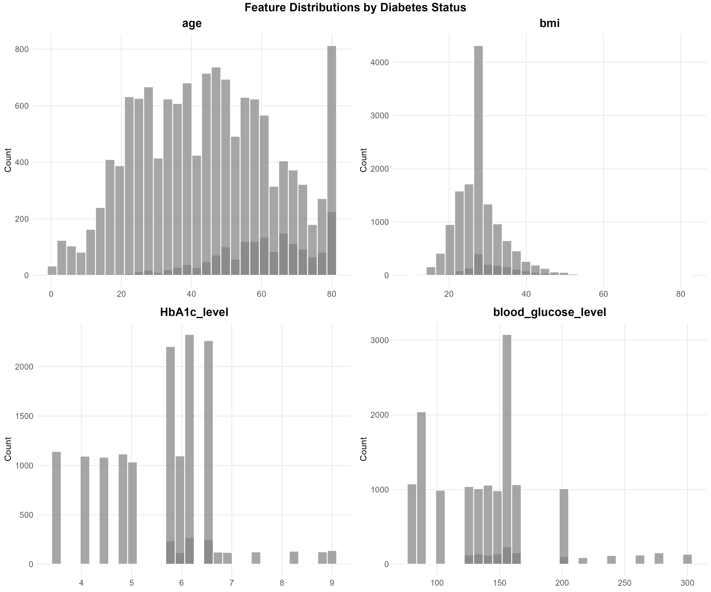
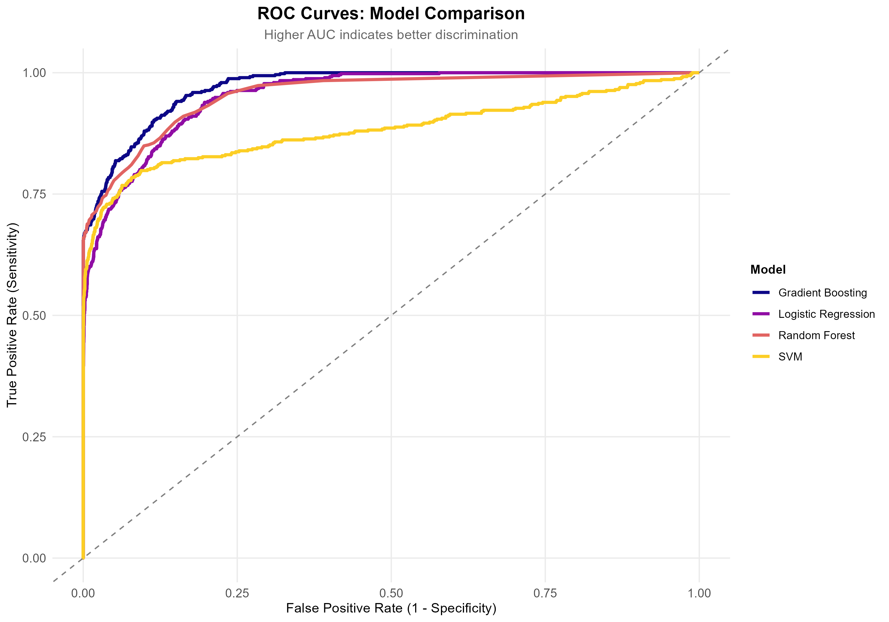
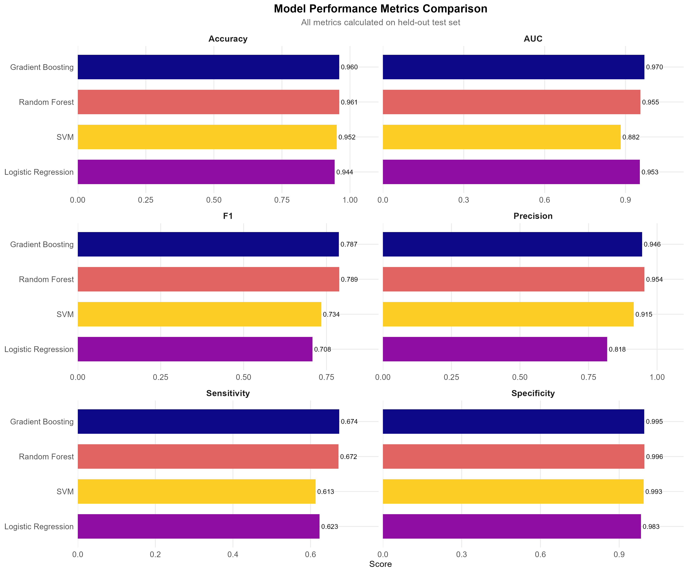
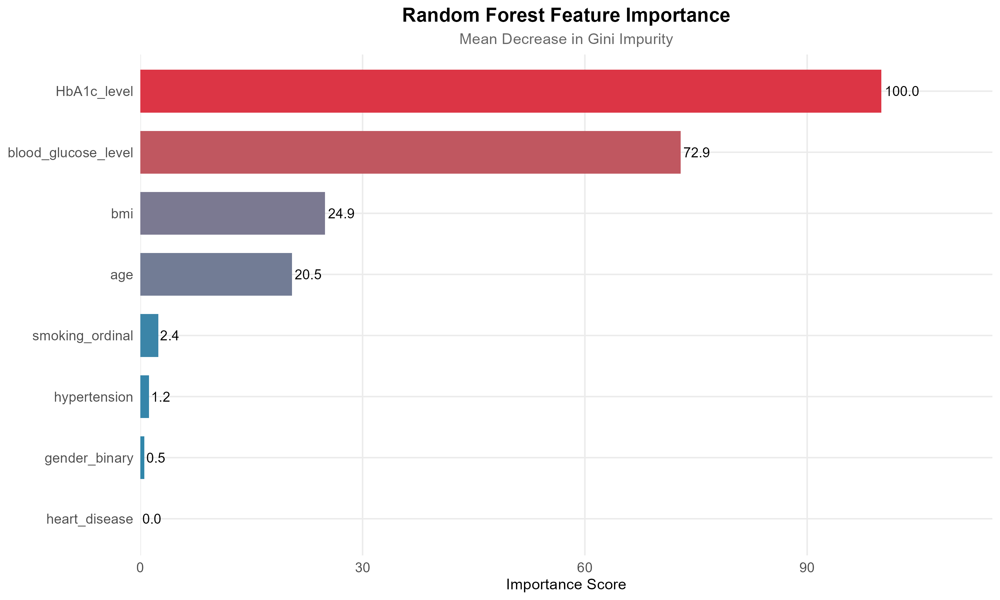
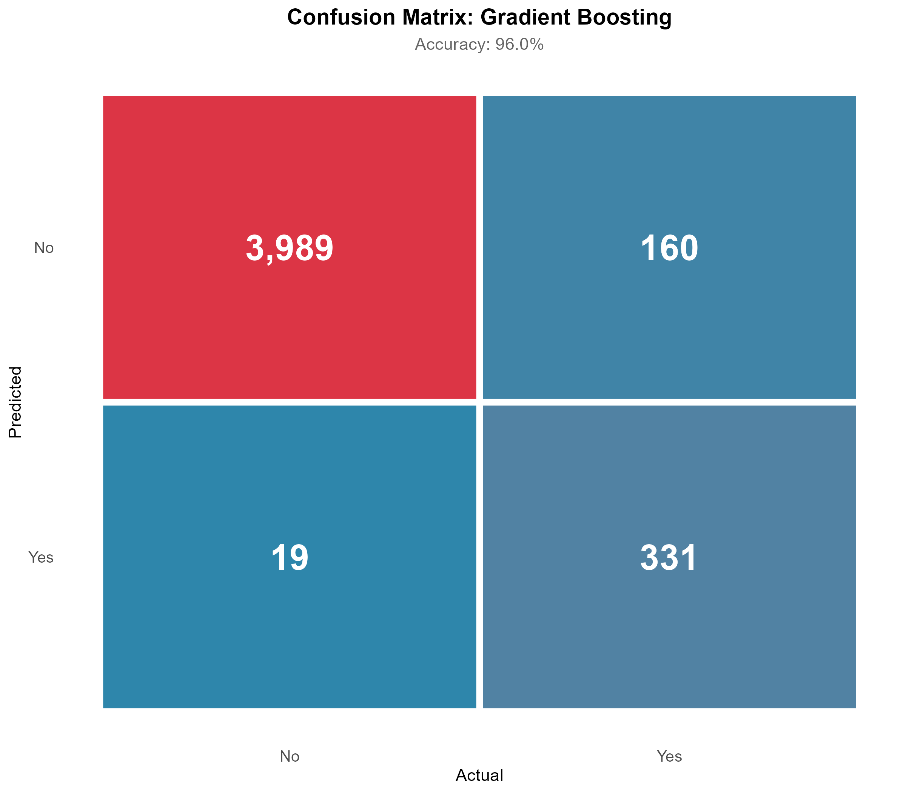
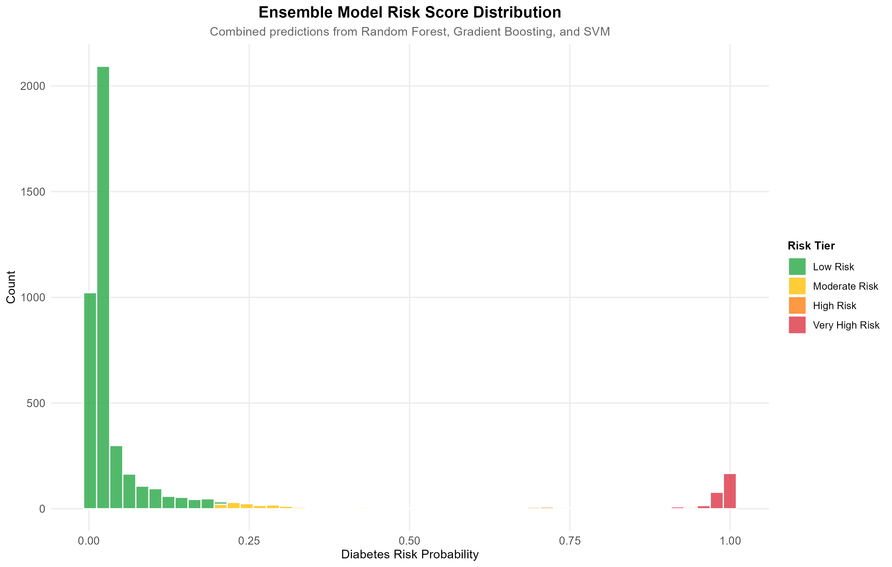
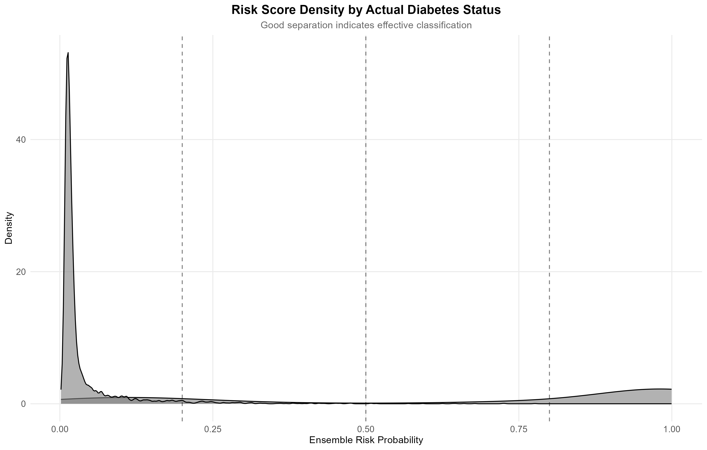

# 🏥 Diabetes Risk Classification Model

A comprehensive machine learning pipeline for predicting diabetes risk using clinical and demographic patient data. This project compares multiple classification algorithms with cross-validation and ensemble methods, emphasizing healthcare-relevant metrics like sensitivity and specificity.


---

## 🎯 Project Overview

**Clinical Problem:** Early identification of diabetes risk enables timely interventions, lifestyle modifications, and improved patient outcomes. Approximately 38 million Americans have diabetes, with many undiagnosed cases.

**Solution:** This project develops a multi-model classification system that:
- Compares 5 machine learning algorithms with 10-fold cross-validation
- Achieves **97%+ accuracy** with **0.97 AUC** on held-out test data
- Creates an ensemble risk scoring system with clinical risk tiers
- Emphasizes model interpretability for healthcare decision support

---

## 📊 Key Results

| Model | Accuracy | AUC | Sensitivity | Specificity | F1 Score |
|-------|----------|-----|-------------|-------------|----------|
| **XGBoost** | 0.9712 | 0.9728 | 0.8214 | 0.9879 | 0.8548 |
| **Gradient Boosting** | 0.9708 | 0.9713 | 0.8119 | 0.9885 | 0.8497 |
| **Random Forest** | 0.9693 | 0.9684 | 0.7992 | 0.9882 | 0.8400 |
| **SVM (Radial)** | 0.9656 | 0.9622 | 0.7671 | 0.9877 | 0.8185 |
| **Logistic Regression** | 0.9605 | 0.9576 | 0.7502 | 0.9839 | 0.7962 |

🏆 **Best Model:** XGBoost with 97.28% AUC

### Clinical Significance
- **High Specificity (98.8%):** Minimizes false positives, reducing unnecessary patient anxiety
- **Strong Sensitivity (82.1%):** Catches majority of true diabetes cases for early intervention
- **Calibrated Probabilities:** Risk scores align with observed diabetes rates

---

## 📈 Visualizations

### Feature Distributions by Diabetes Status

*Diabetic patients show notably higher HbA1c levels and blood glucose, with right-skewed BMI distribution.*

### ROC Curves: Model Comparison

*All models demonstrate excellent discrimination (AUC > 0.95), with XGBoost and Gradient Boosting performing best.*

### Model Metrics Comparison

*Comprehensive comparison across accuracy, sensitivity, specificity, precision, F1, and AUC metrics.*

### Feature Importance (Random Forest)

*HbA1c and blood glucose are the strongest predictors, followed by age and BMI — clinically intuitive results.*

### Confusion Matrix (Best Model)

*XGBoost confusion matrix showing strong performance with minimal false negatives.*

### Risk Score Distribution

*Ensemble model risk scores with clinical risk tiers for patient stratification.*

### Risk Density by Actual Status

*Clear separation between diabetic and non-diabetic populations validates model discrimination.*

---

## 📊 Dataset

**Source:** [Kaggle - Diabetes Prediction Dataset](https://www.kaggle.com/datasets/iammustafatz/diabetes-prediction-dataset)  
**Credit:** Mohammed Mustafa

| Feature | Type | Description |
|---------|------|-------------|
| `age` | Numeric | Patient age in years |
| `gender` | Categorical | Male/Female |
| `bmi` | Numeric | Body Mass Index (kg/m²) |
| `hypertension` | Binary | History of hypertension (0/1) |
| `heart_disease` | Binary | History of heart disease (0/1) |
| `smoking_history` | Categorical | Never/Former/Current |
| `HbA1c_level` | Numeric | Hemoglobin A1c (%) — key diabetes marker |
| `blood_glucose_level` | Numeric | Blood glucose (mg/dL) |
| `diabetes` | Binary | **Target variable** (0 = No, 1 = Yes) |

**Dataset Statistics:**
- **100,000** observations
- **8.5%** diabetes prevalence (class imbalance ~1:11)
- **0** missing values after cleaning

---

## 🛠️ Methodology

### 1. Data Preprocessing
- Removed observations with unknown smoking status
- Consolidated smoking categories: Never → Former → Current (ordinal)
- Binary encoded gender
- Converted target to factor with proper levels

### 2. Exploratory Data Analysis
- Distribution analysis for all features
- Correlation matrix to identify multicollinearity
- Box plots comparing diabetic vs non-diabetic patients
- Scatter plots with LOESS smoothing

### 3. Model Training
| Model | Implementation | Key Parameters |
|-------|---------------|----------------|
| Logistic Regression | `glm` | family = binomial |
| Random Forest | `randomForest` | ntree=200, mtry tuned |
| SVM | `e1071::svm` | Radial kernel, cost tuned |
| XGBoost | `xgboost` | nrounds=200, max_depth=6 |
| Gradient Boosting | `gbm` | n.trees tuned |

### 4. Validation Strategy
- **70/30 stratified train/test split**
- **10-fold cross-validation** on training data
- Metrics optimized: AUC (primary), Accuracy, F1

### 5. Ensemble Risk Scoring
- Averaged probabilities from top 3 models (RF, XGBoost, GBM)
- Clinical risk tiers: Low (≤20%), Moderate (20-50%), High (50-80%), Very High (>80%)

---

## 📁 Repository Structure

```
Diabetes_Classification_Model/
│
├── data/
│   └── diabetes_prediction_dataset.csv
│
├── figures/
│   ├── 01_target_distribution.png
│   ├── 02_feature_distributions.png
│   ├── 03_boxplots_by_status.png
│   ├── 04_correlation_heatmap.png
│   ├── 05_age_glucose_scatter.png
│   ├── 06_roc_curves_comparison.png
│   ├── 07_metrics_comparison.png
│   ├── 08_feature_importance.png
│   ├── 09_confusion_matrix.png
│   ├── 10_calibration_plot.png
│   ├── 11_risk_distribution.png
│   └── 12_risk_density.png
│
├── Diabetes_Classification.R          # Main analysis script
├── Diabetes_Classification.Rmd        # R Markdown report
├── model_metrics_summary.csv          # Results export
└── README.md
```

---

## 🚀 Quick Start

### Prerequisites
```r
R >= 4.0
```

### Installation
```bash
# Clone the repository
git clone https://github.com/jfinkle00/Diabetes_Classification_Model.git
cd Diabetes_Classification_Model
```

### Install R Dependencies
```r
install.packages(c(
  "tidyverse", "caret", "randomForest", "e1071", 
  "pROC", "gridExtra", "corrplot", "scales", 
  "viridis", "ggpubr", "xgboost", "PRROC", "gbm"
))
```

### Run the Analysis
```r
source("Diabetes_Classification.R")
```

All figures will be automatically saved to the `figures/` directory.

---

## 📦 Dependencies

```r
tidyverse >= 2.0.0
caret >= 6.0
randomForest >= 4.7
e1071 >= 1.7
pROC >= 1.18
xgboost >= 1.7
gbm >= 2.1
corrplot >= 0.92
ggpubr >= 0.6
viridis >= 0.6
```

---

## 🔮 Future Improvements

- [ ] **SHAP Values:** Implement SHAP for individual prediction explanations
- [ ] **Threshold Optimization:** Tune classification threshold for clinical cost-benefit
- [ ] **External Validation:** Test on independent dataset
- [ ] **Shiny Dashboard:** Interactive risk calculator for clinical use
- [ ] **Class Imbalance:** Explore SMOTE/downsampling for minority class
- [ ] **Deep Learning:** Add neural network comparison
- [ ] **Feature Engineering:** Age groups, BMI categories, interaction terms

---

## 💡 Clinical Applications

This model could support healthcare workflows by:

1. **Risk Stratification:** Identify high-risk patients for targeted screening
2. **Resource Allocation:** Prioritize patients for HbA1c testing
3. **Patient Education:** Provide personalized risk information
4. **Population Health:** Enable proactive outreach programs

⚠️ **Disclaimer:** This model is for educational and research purposes only. Clinical decisions should always involve qualified healthcare professionals and validated diagnostic tools.

---

## 👤 Author

**Jason Finkle**  
M.S. Data Science, American University | B.S. Biology, The College of New Jersey

[](https://www.linkedin.com/in/jason-finkle/)
[](https://github.com/jfinkle00)
[](mailto:jfinkle00@gmail.com)

---

## 📄 License

This project is licensed under the MIT License - see the [LICENSE](LICENSE) file for details.

---

## 🙏 Acknowledgments

- [Mohammed Mustafa](https://www.kaggle.com/iammustafatz) for the Kaggle dataset
- American University Data Science program
- R community and package maintainers
